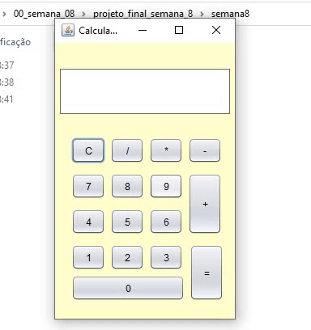
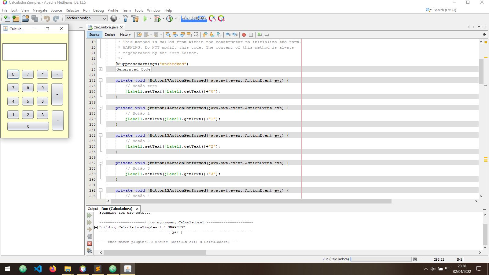
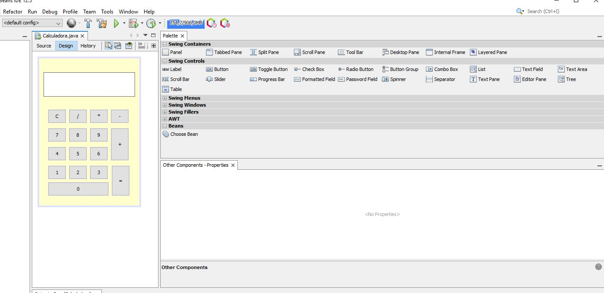

# Pacetech - Semana 8 

 Curso de Introdução à lógica de programação 

### Calculadora Simples (4 operações) 

## CONSTRUÇÃO DE UMA INTERFACE GRÁFICA – UTILIZANDO O SWING NO NETBEANS
 

Nesta semana foi possível aprender a construção de uma calculadora simples, desenvolvida na linguagem Java, com o auxílio da IDE do NetBeans. 
Assim, tal exercício teve intuito de usar o Swing (framework utilizado para fins de auxiliar em interface gráfica) na execução de um algoritmo exprimindo as quatro operações básicas de uma calculadora simples por via da IDE).

 

 

 

Tal objetivo deste exercício, foi de focarmos na construção de um algoritmo com a manipulação da interface gráfica, que até então fazíamos no console da IDE simulando a interação do algoritmo com um usuário final.

### Conceitos básicos para a criação de uma interface gráfica em Java Utilizando o SWING

* [x]Criando uma tela;
* [x]Paleta de Componentes;
* [x]Componentes;
* [x]Propriedades;
* [x]Eventos (programação orientada a eventos);
* [x]Implementando eventos;
* [x]Árvore de componentes;
* [x]Detalhes importantes;

Por fim, nesta semana tive a oportunidade de entender o Swing, que é uma biblioteca de componentes que o Java utiliza para a criação de interface gráfica para criação de telas de um determinado algoritmo desenvolvido e executado.

Desta forma, também foi possível entender a Programação a Eventos, que nada mais é, que a forma que constrói telas. No caso do "NetBeans", é o que chamam de "Drag and Drop". Dos quais, a gente pode clicar na lista de componentes e arrastar. Compondo assim, a interface gráfica de forma mais intuitiva ao programador(a).

### Eu sou, a Anaísa 😃 (Eterna aprendiz!)
- [Twitter](https://twitter.com/AnaisaMayara)
- [Github](https://github.com/anaisateodoro)
- [Email](anaisateodoro@gmail.com)

